# Équipe Heaven - Projet NSI Terminale3 Heaven - 01/10/2022 25/05/2023


## Informations Équipe
- **Membres** :
  - LEVIN Marvyn
  - MORRETI Tony
  - COLIN Cédric
- **Classe** : Terminale 6
- **Langages Utilisés** :
  - Python 3.7.10 (Pygame, Maths, Random, Typing, Enum, Json)
  - Rust 1.67.1 (en cas de fonctionnalités avancées)

## Documents liés au projet
- [Cahier des charges-pdf](./docs/cahierDesChargesTerm.pdf)
- [Soutenance-pdf](./docs/projetHeaven.pdf) [Soutenance-pptx](./docs/projetHeaven.pptx)
- [Logos Team Heaven](./docs/logos/)

## Cahier des Charges

### 1. Présentation du Projet
- **But** : Concevoir un jeu vidéo fonctionnel en 2D de style rétro, immersif et narratif.
- **Moyens** : Utilisation des connaissances en programmation, détermination, et mise en place d'un planning.
- **Langages de Programmation** :
  - **Python** pour le développement principal.
  - **Rust** pour des fonctionnalités avancées éventuelles.

### 2. Types de Fichiers
- **Icônes** : Les icônes sont réalisées par Freepik, source : [Flaticon](https://www.flaticon.com).

### 3. Recherche Documentaire
- **Ressources** :
  - [Cours Pygame](https://www.pygame.org/docs/)
  - [Tutoriels Python Pygame](https://pythonprogramming.net/pygame-python-3/)
  - [Tiled Documentation](https://doc.mapeditor.org/en/stable/manual/index.html)
  
### 4. Répartition du Travail
- **Tony** :
  - Manipulation de Tiled
  - Création de la tileset et de la map
  - Aide avec Pygame
- **Marvyn** :
  - Manipulation de Pygame
  - Création de l'interface du menu
  - Développement de classes (personnages, etc.)
- **Cédric** :
  - Manipulation de Pygame
  - Création de l'interface principale
  - Développement de classes

## Histoire
- **Synopsis** : Kady, une épéiste hors pair, lutte contre Myrtis pour la domination du monde.
- **Personnages Principaux** :
  - Kady 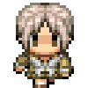 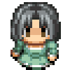 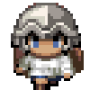 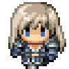 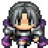 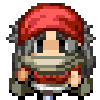 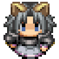 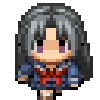 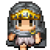
  - Flocon 
  - Gabriel  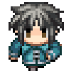
  - Eris 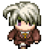 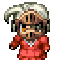 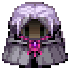
  - Cupidus 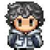
  - Myrtis 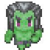

## Concept Graphique
- **Graphismes et Cartes** : 

## Instructions de Lancement

### Prérequis
Pour exécuter ce projet, vous devez avoir **Python** et **Pygame** installés sur votre machine.

### Étapes d'installation

1. **Installer Python :**
   Sur Linux (Ubuntu/Debian), utilisez la commande :
   ```bash
   sudo apt-get install python3
   ```

2. **Installer Pygame :**
   Une fois Python installé, installez la bibliothèque Pygame avec :
   ```bash
   pip install pygame
   ```

3. **Lancer le jeu :**
   Une fois les installations terminées, exécutez le jeu avec la commande :
   ```bash
   python main.py
   ```
